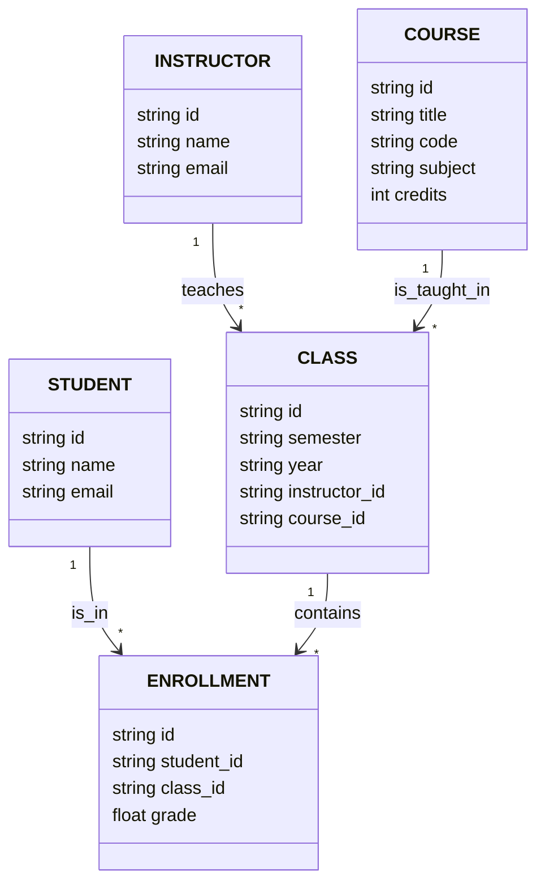

# Documentation

This backend project includes a script to ingest enrollment data and an API for a university's computer science program. It demonstrates efficient data storage and API design.

Read project [instructions](instructions.md).

## Database Design

### Normalization Process

I normalized the data to reduce redundancy and improve consistency by applying three normal forms (1NF, 2NF, 3NF). First, I split the raw CSV into separate tables for **students**, **instructors**, and **courses**, ensuring each table holds atomic values and removing duplicate entries (1NF). Next, I linked students and instructors to their related courses, eliminating partial dependencies and further reducing duplication (2NF). Finally, I handled the many-to-many relationships between students, instructors, and courses by introducing **join tables** (Class and Enrollment), which eliminated transitive dependencies and enabled efficient, scalable queries as the dataset grows (3NF).

#### Benefits of Normalization:

- **Consistency**: Ensures that each student, instructor, and course is represented only once, preventing conflicting or duplicated data.
- **Efficiency**: By reducing redundancy, the database can be queried more quickly, as there are fewer rows and less duplicated information to process.
- **Scalability**: As the university grows, more students, instructors, and courses can be added without making the schema more complex or harder to manage.

##3 Indexing

## Script

This script seeds an SQLite database with course enrollment data from a CSV file. It reads the CSV line by line, checking if each student, instructor, course, and class already exists in the database. If they don't, it inserts them with a UUID as the primary key. The script also handles relationships between students, instructors, courses, and classes by creating appropriate entries in the database for each. After all data is processed, it finalizes the prepared SQL statements and prints the total time taken for the entire process. The database schema is set up using an SQL migration file, and the CSV parsing is done using the csv-parse/sync package. The script ensures no duplicate records are inserted, maintaining data integrity across the database.

TODO: batch insertions? 

