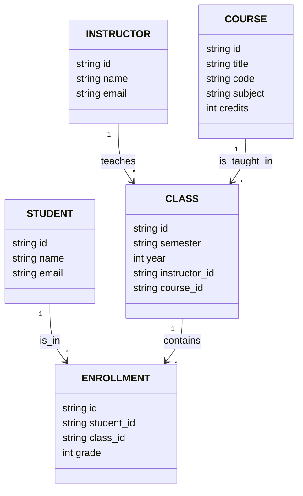

This backend project includes a script to ingest enrollment data and an API for a university's computer science program. It demonstrates efficient data storage and API design.

Read project [instructions](instructions.md).

## Database Design

The database is structured to normalize data, reducing redundancy by separating students, instructors, courses, and enrollments into distinct tables. Primary and foreign keys establish clear relationships between these entities, allowing for flexible course offerings and instructor assignments over different semesters. Indexes on key fields, such as email addresses and foreign keys, enhance query performance, especially for lookups and joins. By creating a `class` table separate from `course`, the design supports different instructors teaching the same course across semesters. The design ensures scalability, data integrity, and efficient querying, while also allowing flexible grading per student enrollment.

## Script

This script seeds an SQLite database with course enrollment data from a CSV file. It reads the CSV line by line, checking if each student, instructor, course, and class already exists in the database. If they don't, it inserts them with a UUID as the primary key. The script also handles relationships between students, instructors, courses, and classes by creating appropriate entries in the database for each. After all data is processed, it finalizes the prepared SQL statements and prints the total time taken for the entire process. The database schema is set up using an SQL migration file, and the CSV parsing is done using the csv-parse/sync package. The script ensures no duplicate records are inserted, maintaining data integrity across the database.

### API

I designed the API with flexibility, scalability, and user experience in mind, allowing clients to retrieve data efficiently while maintaining control over sorting and field selection. By implementing query parameters for filtering, sorting, and selecting specific fields, the API offers a highly customizable interface that reduces unnecessary data transfer and improves performance. Additionally, the use of parameterized queries ensures security against SQL injection, while clear error handling provides meaningful feedback to users. This design allows for efficient data retrieval and makes the API both robust and easy to use for a wide variety of use cases.
View the [api documentation](api-documentation.md) to learn about all the endpoints
